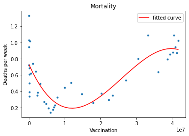
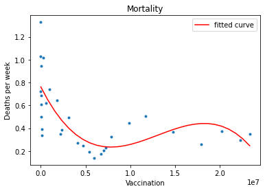
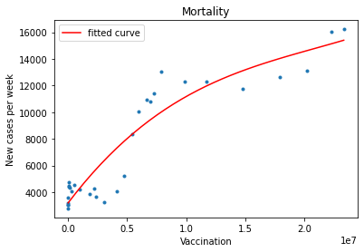

# Overall Trend of Covid-19 
 

### The main purpose is to present how the trend of Covid-19 prevails from 2021-01-01 to 2021-12-19. ### 
  
This project is about **displaying the number of new cases and mortalities(also death rate)** based on the number of vaccinations throughout this year. Also, I have come to know that some people doubt the effect of the vaccine. Hence, I thought it would be a good idea to see the effectiveness of the vaccine.  
  
*Let me be clear that the factors I used in this project are not the only features to be considered. A lot more factors would have been influencial up until this point and will play a certain role in the future. However, I reckoned these are the main features people would be most concerned of hence, decided to exclude the factors besides the three parts I have used.*  
  
    
> - 1. 
>  
> It seemed the number of vaccinations wasn't influencial to the death rate until I figured that the smoothed social distancing policy took place from October.

> - 2. 
>  
> After some pruning process, it now shows the vaccine is actually not meaningless in preventing the serious damage due to the infection.

> - 3.
>  
> The number of cases though, does not seem to decrease. The reason is, as I mentioned in the first place, the number of vaccination may be important factor but not enough to explain the trend of this whole pandemic.

## Conclusion

> The number of vaccination does show effect to curing your body from covid-19. 
> 
> The substantial effect of the vaccine notwithstanding, there are a lot more factors and complicated reasons to be taken into account to precisely analyze the current situation(e.g. policy).